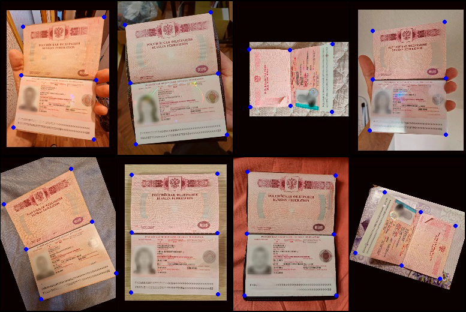

# Passport Keypoints Detection with HRNet

Репозиторий основан на [deep-high-resolution-net.pytorch](https://github.com/leoxiaobin/deep-high-resolution-net.pytorch). Спасибо авторам!

Проект адаптирует HRNet для задачи регрессии 6 контрольных точек документов с переплётом (например, паспорта) для последующего получения плоского разворота документа, имитирующего скан.

<p align="center">
  
</p>

## Основные изменения

- Изменена задача: вместо поз человека — детекция ключевых точек документов
- Добавлен простой аннотатор и скрипт конвертации в формат COCO
- Добавлен кастомный конфиг и класс датасета:
  - 6 ключевых точек вместо 17
  - Удалена зависимость от анатомии человека
  - Аугментации адаптированы под задачу
  - Визуализация адаптирована под документы
- Обновлены зависимости, исправлены ошибки, связанные с устаревшими версиями библиотек

## Установка

Инструкции по установке см. в [оригинальном репозитории](https://github.com/leoxiaobin/deep-high-resolution-net.pytorch#installation).

## Подготовка датасета

Оригиналы изображений документов положить в директорию:
```
data/passport/images/src
```

### Разметка
```bash
python annotator/annotator.py
```

### Конвертация в формат COCO
```bash
python annotator/yaml_to_coco.py
```

## Запуск

### Обучение
```bash
python tools/train.py \
    --cfg experiments/passport/hrnet/w32_256x192_adam_lr1e-3.yaml
```

### Тестирование
```bash
python tools/test.py \
    --cfg experiments/passport/hrnet/w32_256x192_adam_lr1e-3.yaml
```

### Визуализация результатов
```bash
python visualization/plot_coco.py \
    --prediction output/passport/pose_hrnet/w32_256x192_adam_lr1e-3/results/keypoints_valid_results_0.json \
    --save-path visualization/results
```
